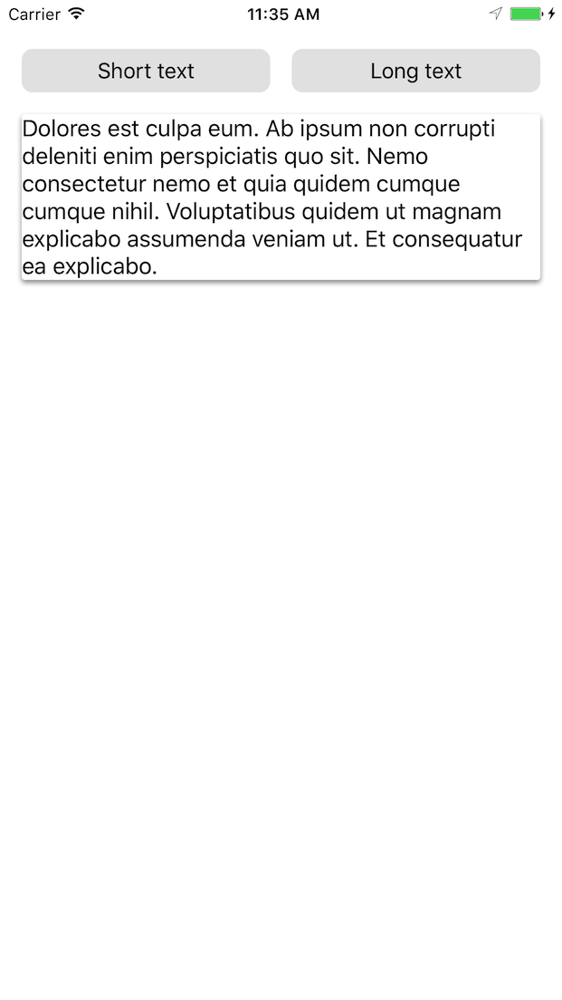
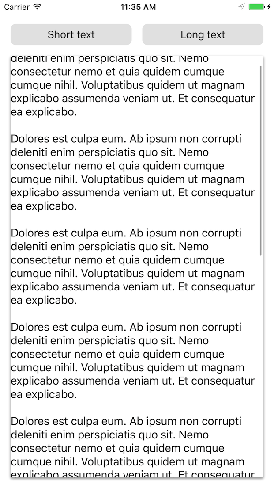

# ScrollingCardView

[](http://cocoapods.org/pods/ScrollingCardView)
[](http://cocoapods.org/pods/ScrollingCardView)
[](http://cocoapods.org/pods/ScrollingCardView)

ScrollingCardView is an iOS card view widget that:

* Hugs its content, dynamically expanding the height when the content height
expands
* Will scroll its content if the content is taller than the card

In the following example, the card view height is constrained to be less
than or equal to the screen size. First, the content does not fill the screen
and neither does the card view:

<div align="center">

</div>

As the content grows, the card view will expand until the screen size,
at which point scrolling is enabled, as demonstrated below:

<div align="center">

</div>

The card's corner radius, background color, and shadow are customizable.

## Motivation
As far as we could find, no existing library met the requirements for the card
view we describe above.

We could repurpose an existing card view library and build the
growing/scrolling functionality on top of it, but this be hard-to-extend and
fragile.

ScrollingCardView was originally created for use in [Mozilla's Project
Prox][prox].

## Usage
```swift
// 1. Create your view, enable autolayout, and add it to the view hierarchy.
let cardView = ScrollingCardView()
cardView.translatesAutoresizingMaskIntoConstraints = false
parentView.addSubview(cardView) // e.g. parent could be the ViewController's view


// 2. Constrain the card view as you would any other view.
NSLayoutConstraint.activate([
    cardView.topAnchor.constraint(equalTo: topLayoutGuide.bottomAnchor, constant: 16),
    cardView.leadingAnchor.constraint(equalTo: view.leadingAnchor, constant: 16),
    cardView.trailingAnchor.constraint(equalTo: view.trailingAnchor, constant: -16),

    // If you don't constrain the height, the card will grow to match its
    // intrinsic content size.

    // Or use lessThanOrEqualTo to allow your card view to grow only until a
    // certain size, e.g. the size of the screen.
    cardView.bottomAnchor.constraint(lessThanOrEqualTo: bottomLayoutGuide.topAnchor, constant: -16),

    // Or you can constrain it to a particular height:
    // cardView.bottomAnchor.constraint(equalTo: bottomLayoutGuide.topAnchor, constant: -16),
    // cardView.heightAnchor.constraint(equalToConstant: 300),
])


// 3. Set your card view's content.
let content = UILabel()
content.text = "Hello world!"
content.numberOfLines = 0

cardView.contentView = content
```

The content can be any view with intrinsic height, or, if you supply a
`heightAnchor`, any view.

You can also customize your card view's appearance:

```swift
cardView.backgroundColor = .white

cardView.cornerRadius = 2

cardView.layer.shadowOffset = CGSize(width: 0, height: 2)
cardView.layer.shadowRadius = 2
cardView.layer.shadowOpacity = 0.4
```

To see this in action, run the example project!

### Requirements
* iOS 9.0+
* Swift 3

### Installation
ScrollingCardView is [available through
CocoaPods](http://cocoapods.org/pods/ScrollingCardView). Add the following to
your Podfile:

```ruby
pod "ScrollingCardView"
```

### Notes
* This project is not tested with Interface Builder
* This project is unlikely to work with non-constraint based layouts

## Example
To run the example project:

```
open Example/ScrollingCardView.xcworkspace
```

Xcode will open: run from there.

## Development
Follow the instructions above to open the example project. The library files
can be found in:

Pods -> Development Pods -> ScrollingCardView -> ScrollingCardView -> Classes

### Testing against external applications
If you're developing against an external application, you can specify a
relative path from the application's podfile to your fork of this library:

```ruby
pod "ScrollingCardView", :path => "../ScrollingCardView"
```

Run `pod install` in the external application's directory.

[prox]: https://github.com/mozilla-mobile/prox
